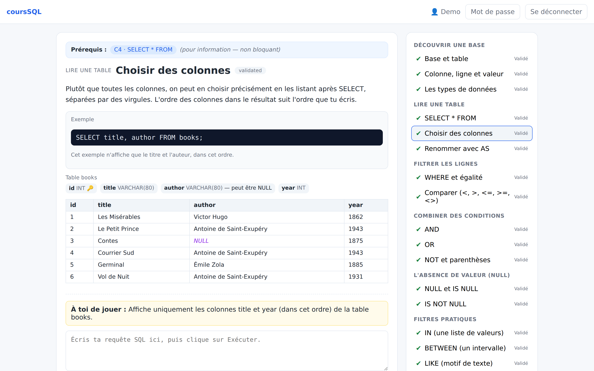
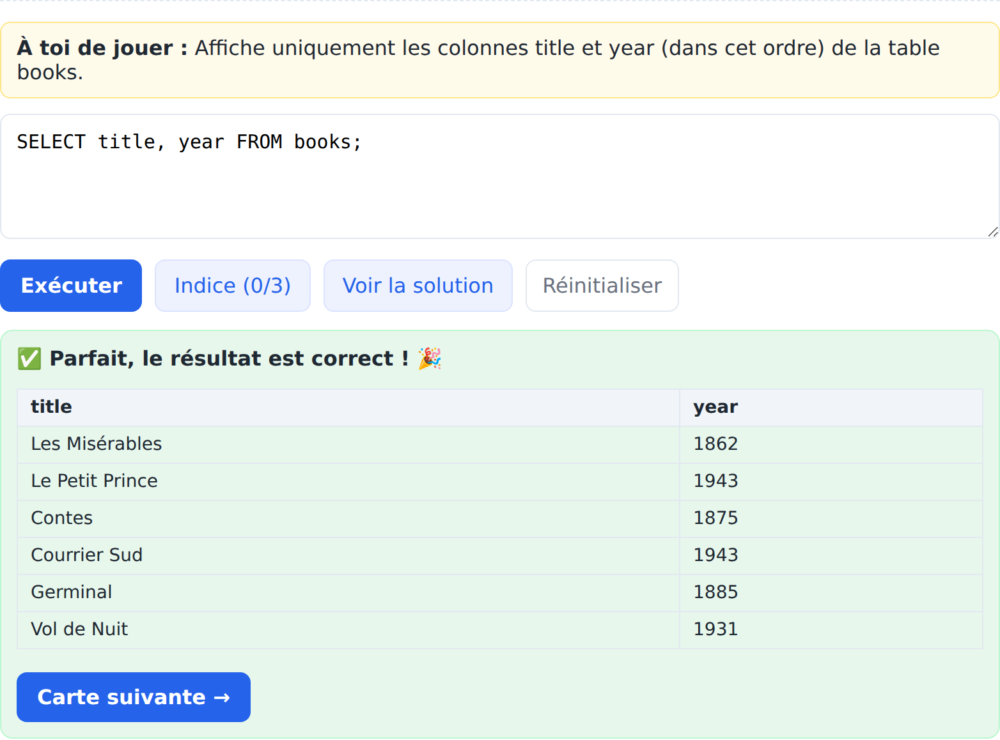
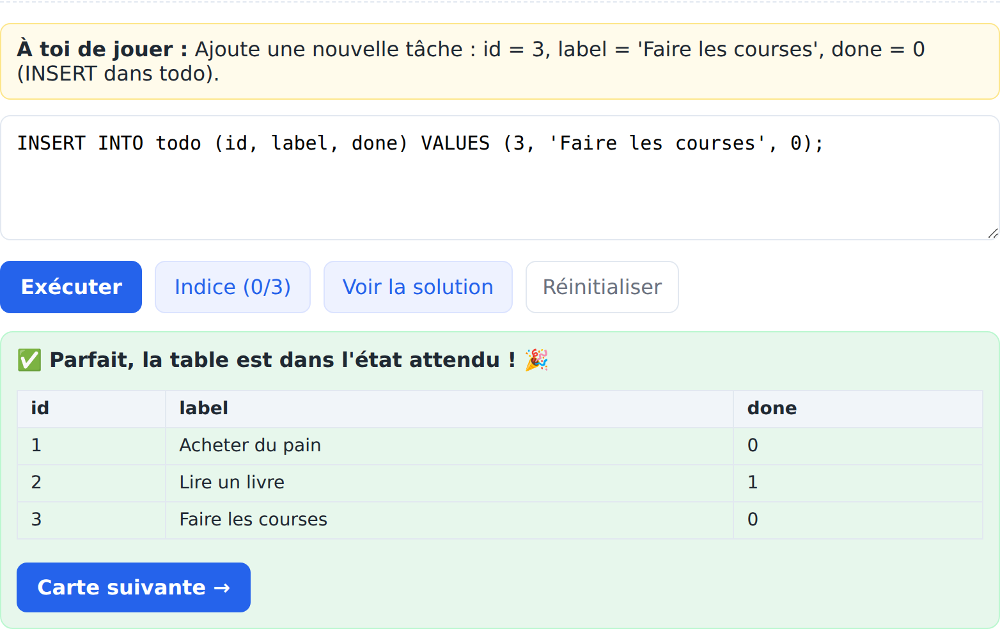
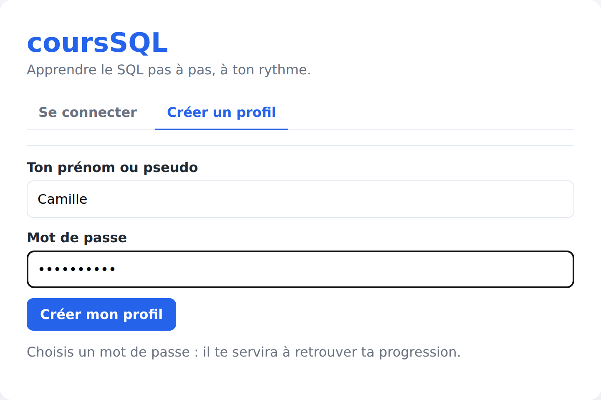
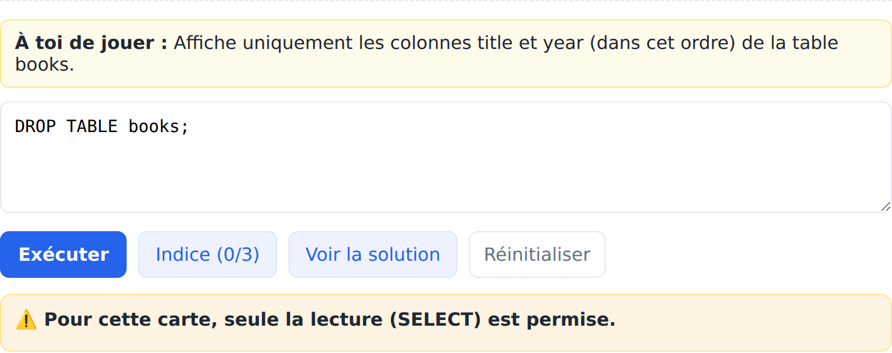

# coursSQL

**An interactive SQL trainer that runs your queries for real — safely.**

coursSQL teaches SQL from the very first `SELECT` up to joins, subqueries, CTEs, transactions and DDL,
through **50 bite-sized cards** across 15 modules. Every exercise is validated on the **result your
query produces**, not on its text — so there is no single "expected string" to guess, and any correct
query passes. Learners type real SQL against a real MySQL database; the interesting engineering is in
letting them do that **on shared hosting with a single database account** without ever exposing the
application's own data.

**Live demo:** https://coursql.shoette.com

> **Version 2.2.1.** The live app is the PHP port described below. A Node/Express implementation of the
> same API is kept for one-command local development (see [Run it locally](#run-it-locally)).



> The application UI is currently in French (a full English translation is planned); the screenshots
> therefore show French labels in this English README.

---

## What it does

- **Card-based curriculum.** One concept per card, spiral pedagogy (few new ideas per lesson, constant
  reuse of prior ones). 50 cards / 15 modules, from `SELECT ... WHERE` to `GROUP BY`/`HAVING`, all join
  kinds, `EXISTS`, CTEs (`WITH`), set operations (`UNION`/`INTERSECT`/`EXCEPT`), and a final project.
- **Three kinds of gating exercise:**
  - **quiz** — multiple choice, for pure-concept cards;
  - **query** — write a `SELECT`; validated by comparing the *result set* against the expected one
    (order- and column-name-sensitivity are configured per card);
  - **mutation** (cards C42–C49) — `INSERT`/`UPDATE`/`DELETE` and DDL (`CREATE`/`ALTER`/`DROP TABLE`,
    indexes, constraints, transactions) run in an **isolated per-user work database**, then validated on
    the *final table state* via a hidden verification query that never reaches the client.
- **Result-based validation with meaningful data.** Seed rows are chosen so a plausible-but-wrong
  variant yields a *different* result (a row exactly on a `<` vs `<=` boundary, a `NULL` for `IS NULL`,
  duplicates for `DISTINCT`, …), so passing means understanding the concept.
- **Forgiving progression.** Unlimited attempts, per-card hints, and an on-demand solution (viewing it
  does not auto-validate). Progress is tracked per learner; a card unlocks the next one.
- **Pedagogical errors, never raw SQL errors.** A failed query maps to a teaching message; the raw
  MySQL error text, DSN and stack traces are never sent to the browser.

## Screenshots

**Solving a query card** — write SQL in the editor, run it, and get validated on the actual result set:



**A mutation card (C42–C49)** — `INSERT`/`UPDATE`/`DELETE`/DDL run in an isolated per-user work table,
validated on the final table state:



**Password authentication** — sign up or sign in with a password; profiles are never listed publicly:



## Security model — the interesting part

The whole point of coursSQL is executing **untrusted, learner-written SQL** against a live database.
On OVH shared hosting there is exactly **one MySQL account and one database**, so the classic defence
(a locked-down `executor` account with `SELECT`-only grants) is not available. coursSQL replaces it with
an **application-level guard**, [`php/api/lib/SqlGuard.php`](php/api/lib/SqlGuard.php):

1. **Preflight** — length cap, rejection of NUL/control characters, Unicode-space homoglyphs, and MySQL
   executable comments (`/*! ... */`).
2. **Parser-backed** — the SQL is lexed and parsed with a vendored `phpmyadmin/sql-parser`; anything
   that does not parse to exactly one statement is rejected.
3. **Positive allowlists** — keywords, functions and operators are **allow-listed**, not deny-listed.
   Unknown tokens are blocked by default.
4. **Mandatory table resolution** — every table reference must resolve through the card's
   logical→physical name map. Unmapped names, qualified `db.table` names, and reserved physical prefixes
   (`app_`, `seed_`, `wk_`) are refused — so `information_schema`, the app's own tables, and other users'
   work tables are unreachable **by construction**, and each learner only ever sees prefixed table names.
5. **Independent post-rewrite pass** — after rewriting logical names to physical ones, the guard
   **re-lexes and re-validates the exact string that will be executed**, and re-checks that every table
   is a physical name from the map. A rewrite bug therefore cannot smuggle anything through, because the
   final string is verified on its own terms.
6. **Driver backstop** — PDO runs with `MULTI_STATEMENTS` disabled and emulated prepares off, so
   statement stacking cannot work even if the guard were bypassed.

A forbidden statement is rejected cleanly with a teaching message instead of ever reaching the database
— here a `DROP TABLE` on a read-only card:



Mutating cards get an extra layer: each learner×card pair gets its own set of prefixed work tables,
guarded by a short-lived DB lock, reset (`DROP`+`CREATE`+seed) before each attempt, and validated on a
**separate connection** so an uncommitted transaction rolls back as intended.

Additional hardening: HttpOnly + `SameSite=Lax` session cookies with strict-mode sessions and id
regeneration on login; parameterised queries everywhere on the server side; security headers and
deny-all rules for private files and `vendor/` in `.htaccess`; and **request rate limiting** (new in
2.1.0) on account creation and on the SQL-execution/reset routes, returning HTTP 429 over quota.

## Architecture

```
Browser ──HTTPS──> Apache (.htaccess front controller)
                     ├── static React SPA (built assets)
                     └── /api/*  ─> php/api/index.php  ──PDO──> single MySQL database
                                     ├── SqlGuard (allowlist + rewrite + post-check)
                                     ├── prefixed namespaces: app_* / seed_* / wk_*
                                     └── card content loaded from cards.json (outside the webroot)
```

- **Single origin, no CORS.** The React client is served next to the API and calls `/api/*` relatively.
- **Single database, namespaced by table prefix.** `app_*` = application state (users, progress,
  attempts, locks, rate limits); `seed_*`/`seedref_*` = shared read-only teaching data; `wk_*` =
  isolated per-user work tables for mutating cards.
- **Secrets and answers stay out of the webroot.** DB credentials live in a private `config.local.php`;
  full card content (with solutions and expected results) lives in a `cards.json` served from **outside**
  the web root and denied by `.htaccess` in depth.

## Tech stack

- **Client:** React 18 + TypeScript, built with Vite.
- **API (production):** PHP 8.1+ (8.3 in production), PDO/MySQL, native sessions.
- **API (development):** Node.js + TypeScript (Express, `mysql2`) — same routes and contract.
- **Database:** MySQL 8.4 (≥ 8.0.31 required for `INTERSECT`/`EXCEPT`).
- **SQL parsing:** `phpmyadmin/sql-parser`.

## Run it locally

The quickest way to try coursSQL locally uses the **development stack** (the Node implementation of the
same API) under Docker Compose:

```bash
cp .env.example .env          # dev-only credentials; change them for any real deployment
docker compose up -d --build  # builds the React client + the API and starts MySQL
```

Then open **http://localhost:8080** and create a profile. On a cold start the API waits a few seconds
for MySQL to accept connections; check readiness with `curl http://localhost:8080/api/health`.

Suggested first run: create a profile → C1–C3 (quiz) → **C4** type `SELECT * FROM books;` → **C5**
`SELECT title, year FROM books;`. Try a wrong query (e.g. `SELECT titre FROM books;`) to see a teaching
error, or `UPDATE books SET year = 0;` on a read-only card to see it blocked.

Building and deploying the **production PHP port** (static client + PHP API + single-database schema for
shared hosting) is documented in [`DEPLOY.md`](DEPLOY.md).

## Project structure

```
php/                 # production PHP API (front controller, SqlGuard, routes) + vendored parser
  api/lib/SqlGuard.php  # the security guard (worth a read)
client/              # React + TypeScript SPA (Vite)
api/                 # Node/TypeScript dev API + versioned card content (src/content/cards.ts)
deploy/ovh/          # build scripts, single-database schema, migrations
db/init/             # local MySQL init (schema, accounts, seed data) for the dev stack
docs/                # DESIGN.md (detailed design & security rationale)
docker-compose.yml   # one-command local dev stack
```

## Documentation

- [`docs/DESIGN.md`](docs/DESIGN.md) — detailed design: pedagogy, exercises, architecture, security,
  and the API contract.
- [`CHANGELOG.md`](CHANGELOG.md) — version history.
